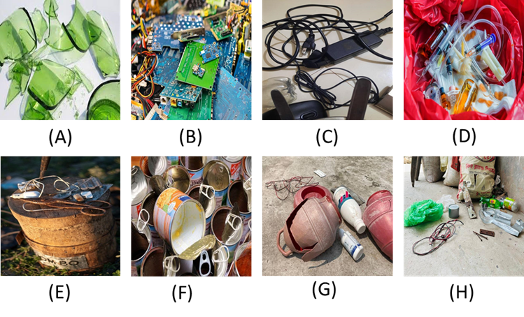
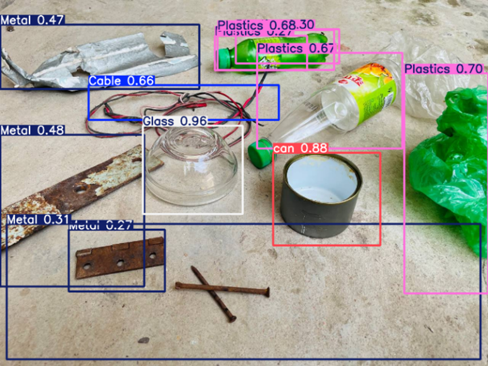

# TrashNet++ Dataset

A comprehensive waste classification dataset for object detection and classification tasks, containing 2,600 annotated images across 7 waste categories.

## 📊 Dataset Overview

- **Total Images**: 2,600
- **Classes**: 7 waste categories
- **Format**: YOLO v8 format
- **License**: CC BY 4.0
- **Resolution**: 640x640 pixels (resized)

# 📷 Sample Data



## 🗂️ Dataset Structure

```
TrashNet++/
├── data.yaml                 # Dataset configuration file
├── train/                    # Training set (1,825 images)
│   ├── images/              # Training images
│   └── labels/              # Training annotations (.txt files)
├── valid/                    # Validation set (515 images)
│   ├── images/              # Validation images
│   └── labels/              # Validation annotations (.txt files)
├── test/                     # Test set (260 images)
│   ├── images/              # Test images
│   └── labels/              # Test annotations (.txt files)
└── README.md                 # This file
```

## 📷 Folder Structure Image


## 🏷️ Classes

The dataset contains 7 waste categories:

| Class ID | Class Name | Description |
|----------|------------|-------------|
| 0 | Cable | Electrical cables and wires |
| 1 | E-waste | Electronic waste items |
| 2 | Glass | Glass bottles and containers |
| 3 | Medical Waste | Medical and pharmaceutical waste |
| 4 | Metal | Metal cans and containers |
| 5 | Plastics | Plastic bottles and containers |
| 6 | Can | Aluminum and tin cans |

## 📋 Dataset Statistics

| Split | Images | Percentage |
|-------|--------|------------|
| Train | 1,825 | 70.2% |
| Validation | 515 | 19.8% |
| Test | 260 | 10.0% |
| **Total** | **2,600** | **100%** |

## 🔧 Annotation Format

The dataset uses YOLO format annotations. Each image has a corresponding `.txt` file with the same name containing:

```
class_id center_x center_y width height
```

Where:
- `class_id`: Integer (0-6) representing the waste category
- `center_x`, `center_y`: Normalized coordinates of bounding box center
- `width`, `height`: Normalized width and height of bounding box

### Example Annotation:
```
6 0.51328125 0.5171875 0.71171875 0.84296875
```
This represents a "Can" object (class 6) with normalized bounding box coordinates.

## 🚀 How to Use This Dataset

### 1. For YOLO Training

```python
# Using with YOLOv8
from ultralytics import YOLO

# Load the model
model = YOLO('yolov8n.pt')

# Train on the dataset
results = model.train(data='data.yaml', epochs=100, imgsz=640)
```

### 2. For Custom Training

```python
import torch
from torch.utils.data import Dataset, DataLoader
import cv2
import numpy as np

class TrashNetDataset(Dataset):
    def __init__(self, images_dir, labels_dir, transform=None):
        self.images_dir = images_dir
        self.labels_dir = labels_dir
        self.transform = transform
        self.image_files = [f for f in os.listdir(images_dir) if f.endswith('.jpg')]
    
    def __len__(self):
        return len(self.image_files)
    
    def __getitem__(self, idx):
        # Load image and annotations
        img_path = os.path.join(self.images_dir, self.image_files[idx])
        label_path = os.path.join(self.labels_dir, 
                                 self.image_files[idx].replace('.jpg', '.txt'))
        
        image = cv2.imread(img_path)
        image = cv2.cvtColor(image, cv2.COLOR_BGR2RGB)
        
        # Load annotations
        boxes = []
        labels = []
        if os.path.exists(label_path):
            with open(label_path, 'r') as f:
                for line in f.readlines():
                    data = line.strip().split()
                    if len(data) == 5:
                        class_id, cx, cy, w, h = map(float, data)
                        boxes.append([cx, cy, w, h])
                        labels.append(int(class_id))
        
        if self.transform:
            image = self.transform(image)
            
        return image, {'boxes': torch.tensor(boxes), 'labels': torch.tensor(labels)}
```

### 3. Data Loading Example

```python
# Load dataset configuration
import yaml

with open('data.yaml', 'r') as f:
    data_config = yaml.safe_load(f)

print("Classes:", data_config['names'])
print("Number of classes:", data_config['nc'])
```
# 📷 Performance



## 📈 Performance Metrics

When training on this dataset, consider evaluating using:

- **mAP@0.5**: Mean Average Precision at IoU threshold 0.5
- **mAP@0.5:0.95**: Mean Average Precision across IoU thresholds 0.5-0.95
- **Precision**: True positives / (True positives + False positives)
- **Recall**: True positives / (True positives + False negatives)

## 🔄 Data Preprocessing

The dataset has been preprocessed with:
- ✅ Auto-orientation of pixel data (EXIF-orientation stripping)
- ✅ Resize to 640x640 pixels (stretch)
- ❌ No augmentation techniques applied

## 📚 Citation

If you use this dataset in your research, please cite:

```bibtex
@dataset{trashnet_plus_plus_2025,
  title={TrashNet++: Enhanced Waste Classification Dataset},
  author={Dataset Contributors},
  year={2025},
  url={https://github.com/your-username/TrashNet-Plus-Plus},
  license={CC BY 4.0}
}
```

## 🤝 Contributing

Contributions to improve the dataset are welcome! Please:

1. Fork the repository
2. Create a feature branch
3. Make your changes
4. Submit a pull request

## 📄 License

This dataset is licensed under the Creative Commons Attribution 4.0 International License (CC BY 4.0).

## 🔗 Related Resources

- [Roboflow Universe](https://universe.roboflow.com/code2gether/west-classification-gfnpa/dataset/3)
- [YOLOv8 Documentation](https://docs.ultralytics.com/)
- [Computer Vision Training Notebooks](https://github.com/roboflow/notebooks)

## 📞 Support

For questions or issues with the dataset, please:
- Open an issue on GitHub
- Contact the maintainers
- Check the documentation

---

**Note**: This dataset is designed for research and educational purposes. Please ensure compliance with local regulations when handling waste materials in real-world applications.
